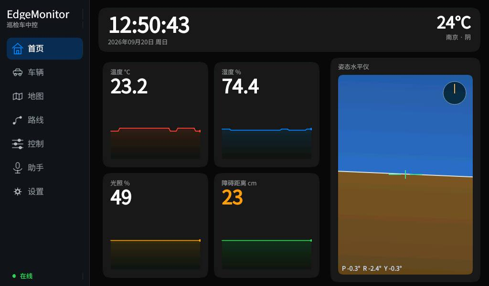
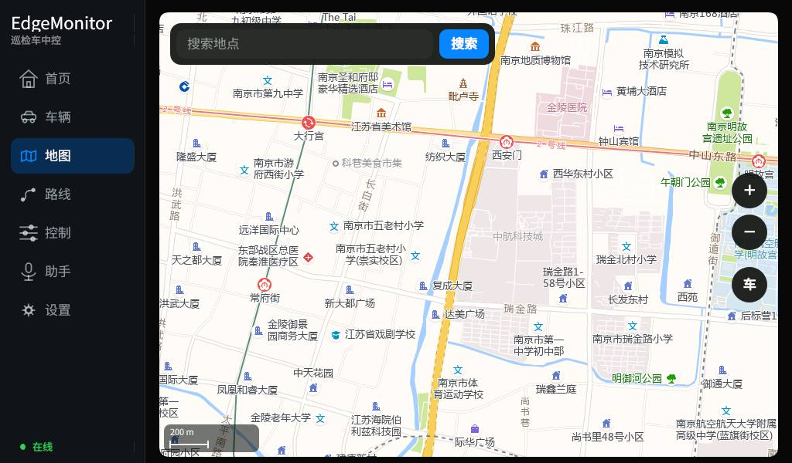
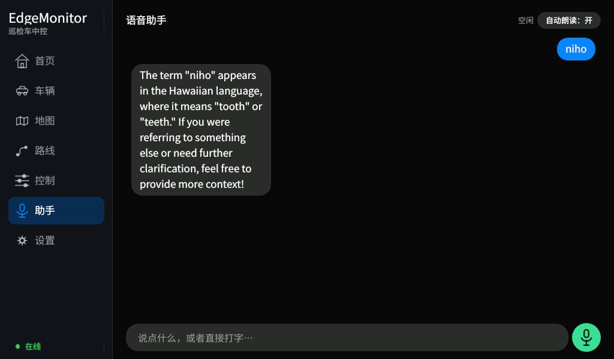
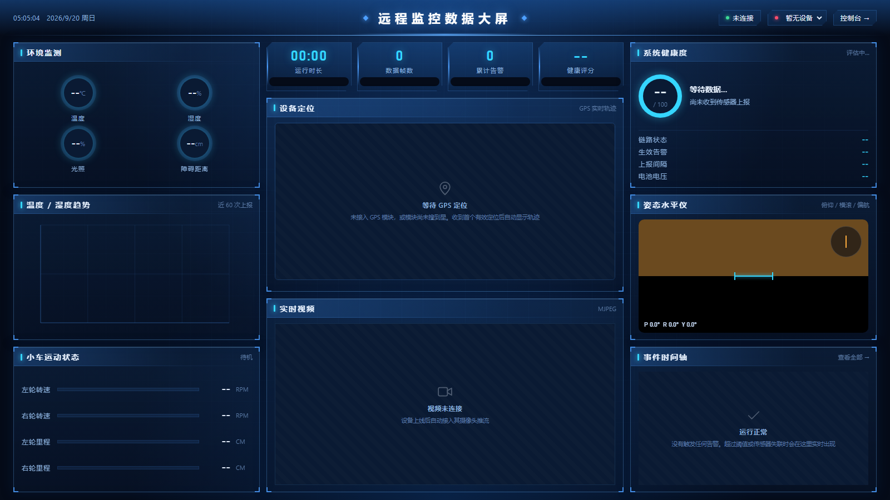
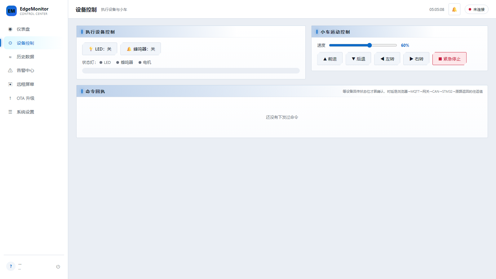

# EdgeMonitor —— 基于 CAN 总线的多传感器远程监控与 OTA 固件升级系统

面向**园区巡检机器人**的移动设备远程监控与运维平台原型。

多源传感采集 → CAN 总线 → 嵌入式 Linux 边缘网关 → MQTT → Web 数据大屏，
外加车载 Qt 触摸中控（含地图与中文输入）、V4L2 视频回传、UDS/A-B 双分区 OTA、
电机闭环控制，形成「感知 → 控制 → 边缘 → 云 → 视觉 → 升级」的完整闭环。

> 这个仓库里除了代码，还有一份 [`deploy/优化记录.md`](deploy/优化记录.md)
> 记录了每一个真实故障的**现象 / 定位过程 / 根因 / 验证方法**。
> 如果你只想看一样东西，看那个 —— 代码能说明"做了什么"，那份记录说明"为什么这么做"。

---

## 界面

### 车载 Qt 中控（i.MX6ULL + 7 寸屏，1024×600）



首页。四张指标卡下方是实时趋势线 —— 一个瞬时数字回答不了"它在往哪走"，
而障碍距离 30cm 是正在接近还是正在远离，是两件完全不同的事。
障碍距离按远近自动变色（图中 23cm 显示为橙色）。



地图页。板子没有 GPU，Qt WebEngine 跑不了，所以不嵌高德 JS SDK，
而是自己按 Web 墨卡托算瓦片号、拉栅格瓦片、`QPainter` 贴图，
搜索和路径规划走高德 REST 接口自己渲染。控件悬浮在满屏地图之上。



语音助手（讯飞听写 / 合成 / 星火）。底部软键盘是自绘的，
支持中英切换和拼音候选词（见下文"中文输入"）。

### Web 端



数据大屏。**截图是未连接设备时的空状态** —— 各面板显示的是各自的"没有数据"
提示而不是假数字，这本身也是设计的一部分（见"不让故障伪装成正常"）。



控制台（日间模式）。大屏固定深色、控制台可切换日夜；
两者的主色保持同一族，不会切个主题就换一种品牌色。

---

## 一、系统架构

```
   ── 巡检机器人（会移动、会掉线）──          ── 服务器 / VM（固定、常在线）──

[超声波][MPU6050][DHT11][光敏]   [RTK/GNSS]
[TB6612+编码器电机×2]              │ USB CDC-ACM / NMEA
        │                         │
   STM32F103 (FreeRTOS)           │
   采集 + 电机 PI 闭环 + 看门狗     │
        │ CAN 500K                 ▼
        └──────────► i.MX6ULL 边缘网关
                     ├─ 板载 MQTT broker ◄── 本机所有客户端都连它
                     │    ├─ gateway_mqtt  (CAN ↔ MQTT)
                     │    ├─ gps_mqtt      (NMEA 解析 + NTRIP 差分)
                     │    ├─ ota_service   (UDS over CAN)
                     │    └─ Qt 中控       (7 寸屏)
                     ├─ USB 摄像头 (自写 V4L2 + MJPEG 推流, token 鉴权)
                     ├─ 远程屏幕 (framebuffer 抓屏 + 触摸注入)
                     └─ 手机遥控 (板载 HTTP, 直写 CAN, 令牌 + 死人开关)
                              │
                          bridge（MQTT 桥接，单向拉遥测 / 单向送指令）
                              ▼
                        VM 上的 broker ──► Web 大屏（WebSocket）
                                       └─► history_logger（MQTT→SQLite+查询API）
```

### broker 为什么从服务器搬到了板子上

一开始 broker 在 VM 上，数据流是

```
gateway_mqtt(板子) → 你电脑的 portproxy → VM 的 broker → Qt 界面(板子)
```

发送方和接收方**都在板子上**，中间却要绕一圈经过虚拟机。虚拟机一关机，
板子自己的屏幕就不刷新了、控制页也发不出指令 ——
一个本该自洽的嵌入式设备，被一台开发用的虚拟机卡住了脖子。

搬到板子上之后：**车自己跑起来不依赖任何上位机**；VM 和 Web 退化成
**旁观者**，连得上就能看，连不上也只是看不到，不影响车跑。

代价是 MQTT 的 LWT 遗嘱机制失去了原有的意义（broker 和设备同生共死，
拔电时没人代发遗嘱）。所以现在"设备是否在线"由**桥接链路**来判断：
VM 侧的 broker 收不到桥接数据就是设备离线。判断点从设备内部移到了外部，
这正是 LWT 原本想解决的问题，只是换了一层。

### 桥接为什么逐条列方向，而不是一条 `monitor/# both`

```
topic monitor/+/data/#       in      遥测：板子 → VM
topic monitor/online/+       in
topic monitor/+/ota/progress in
topic monitor/+/ota/status   in
topic monitor/+/cmd          out     指令：VM → 板子
topic monitor/+/ota/cmd      out
topic monitor/+/config/#     out     ← 只有 out，没有 in
```

最后一行是关键：**同一个主题，两个方向的安全含义完全相反**。
`config/#` 里是第三方服务的密钥，下发（out）是必须的，
上行（in）则意味着密钥会被搬到板子外面去。一条 `both` 图省事就会把这条路打开。

---

## 二、快速开始

### 依赖

| 组件 | 工具链 |
|---|---|
| STM32 固件 | Keil MDK5 + ARMCC V5（工程自带 HAL 库和 FreeRTOS） |
| i.MX6ULL 网关 / Qt | Poky SDK `fsl-imx-x11-glibc-x86_64-meta-toolchain-qt5-cortexa7hf-neon 4.1.15-2.1.0` |
| 服务器侧 | Python 3.6+、mosquitto 1.6+ |

### 1. STM32 固件

```
Keil 打开 EdgeMonitor_App/Projects/MDK-ARM/atk_f103.uvprojx
两个 target 都要 Rebuild：FreeRTOS_SlotA 和 FreeRTOS_SlotB
```

> A/B 双分区用的是 **direct-xip**：两个槽的固件链接地址不同（`0x08004000` / `0x08040000`），
> 是**两份不能互换的 bin**，必须都编。

Keil 只产出 `.axf`，OTA 要的是 `.bin`：

```
fromelf --bin --output=atk_f103_a.bin atk_f103_a.axf
fromelf --bin --output=atk_f103_b.bin atk_f103_b.axf
```

Bootloader 在 `EdgeMonitor_Boot/`，只需烧一次（J-Link/ISP）。

⚠️ **Keil → Debug → Settings → Port 必须选 SW，不能选 JTAG。**
固件里调了 `__HAL_AFIO_REMAP_SWJ_NOJTAG()` 释放 PA15/PB3/PB4 给编码器用，
选 JTAG 会导致烧录后再也连不上（要拉 BOOT0 进 ISP 才能救）。

### 2. i.MX6ULL 网关 / Qt 界面

```sh
. /opt/fsl-imx-x11/4.1.15-2.1.0/environment-setup-cortexa7hf-neon-poky-linux-gnueabi

# 网关（静态链接 libmosquitto，避开板子上的 GLIBC 版本差异）
arm-linux-gnueabihf-gcc gateway_imx6ull/gateway_mqtt.c -o gateway_mqtt \
    -I mosquitto-1.6.15/lib mosquitto-1.6.15/lib/libmosquitto.a -lpthread -lm

# Qt 中控
cd imx6ull_ui && qmake && make -j4
```

> **必须先 source SDK 环境**，否则 `make` 会用宿主机的 gcc 静默产出 x86 二进制。

### 3. 板载 broker

```sh
# broker 本体（交叉编译时必须带 TLS，否则它没有能力校验任何口令——见"安全设计"）
cd mosquitto-1.6.15
make CROSS_COMPILE= CC="$CC" WITH_TLS=yes WITH_WEBSOCKETS=no WITH_SRV=no WITH_DOCS=no

# 部署到板子
scp src/mosquitto src/mosquitto_passwd root@<板子IP>:/home/root/
scp deploy/board/mosquitto-board.conf root@<板子IP>:/home/root/mosquitto.conf
scp deploy/board/acl-board            root@<板子IP>:/home/root/mosquitto_acl

# 在板子上建账号（三个账号按读写方向分，见"安全设计"）
/home/root/mosquitto_passwd -b /home/root/mosquitto_passwd em     <密码>
/home/root/mosquitto_passwd -b /home/root/mosquitto_passwd ui     <密码>
/home/root/mosquitto_passwd -b /home/root/mosquitto_passwd bridge <密码>
```

> broker **只在启动时读口令文件**。改完密码必须重启它，否则新账号一直认证失败，
> 而日志里只有一句 `not authorised`，看不出是"密码错"还是"没重新加载"。

### 4. VM 侧（Web 大屏 + 历史库 + 桥接）

```sh
# 桥接到板子（把 __在安装前替换成真实密码__ 换成 bridge 账号的密码）
sudo cp deploy/board/bridge-to-board.conf /etc/mosquitto/conf.d/
sudo systemctl stop mosquitto; sleep 3; sudo systemctl restart mosquitto

# 历史落库 + 查询 API
cp deploy/edgemonitor-server.env.example /etc/edgemonitor-server.env   # 改密码
python3 server/history_logger.py

# Web 大屏（静态文件）
cd web && python3 -m http.server 8080
```

> 那个 `stop` + `sleep 3` 不是凑数：mosquitto 在某些发行版上是 LSB init 服务，
> `systemctl restart` 的 stop 阶段可能杀不干净旧进程，新实例绑不上 1883 就退出，
> 结果是**一个都不剩**。而 `systemctl start` 对 `active (exited)` 状态的服务
> 是空操作，日志里连一条新记录都没有。

### 5. 设备侧配置

```sh
cp deploy/edgemonitor.env.example /etc/edgemonitor.env
chmod 600 /etc/edgemonitor.env      # 里面有 broker 密码和遥控令牌
vi /etc/edgemonitor.env
cp deploy/sysvinit/edgemonitor-daemon.sh /home/root/ && chmod +x /home/root/edgemonitor-daemon.sh
```

`/etc/edgemonitor.env` 是**所有运行期配置的唯一来源**：

| 变量 | 用途 |
|---|---|
| `MQTT_HOST` / `MQTT_USER` / `MQTT_PASS` | 采集侧账号（网关 / GPS / OTA） |
| `MQTT_UI_USER` / `MQTT_UI_PASS` | Qt 界面的账号（权限方向与采集侧相反） |
| `MQTT_BRIDGE_PASS` | VM 桥接用的账号 |
| `CTRL_TOKEN` | 手机遥控页的访问令牌，**留空 = 任何人都能开车** |
| `NTRIP_HOST/PORT/MOUNT/USER/PASS` | CORS 差分账号，不配则只有单点解 |
| `DEVICE_ID` | topic 前缀，多设备隔离 |

> 改完之后**已在运行的进程不会重读**（`getenv` 只在 `main()` 里执行一次），
> 必须 `killall` 让守护脚本重新拉起。

---

## 三、硬件与接线

### 清单

- 正点原子战舰 STM32F103ZET6（板载 TJA1050 CAN 收发器）
- 传感器：HC-SR04 超声波、MPU6050、DHT11、光敏电阻
- 执行器：LED、蜂鸣器、**WHEELTEC TB6612 稳压版驱动 + MG513 P28 编码器电机 ×2 + Φ65 轮**
- i.MX6ULL + 7 寸 RGB 屏 + USB 摄像头 + USB WiFi + RTK/GNSS 模块
- CAN 双绞线 + **共地线** + 120Ω 终端电阻

### STM32 引脚分配

| 功能 | 引脚 | 说明 |
|---|---|---|
| CAN1 | PA11 / PA12 | RX / TX |
| USART1 | PA9 / PA10 | 调试串口 115200 |
| DHT11 | PG11 | 单总线 |
| HC-SR04 | PE6 (TRIG) / PB6 (ECHO) | ECHO = TIM4_CH1 输入捕获，**必须配 GPIO_PULLDOWN** |
| 光敏 | PA1 | ADC1_CH1 |
| 电池电压 | PC5 | ADC1_CH15，经模块 100k/10k 分压 |
| MPU6050 | PB10 / PB11 | 软件 I2C |
| LED / 蜂鸣器 | PE5 / PB8 | |
| **电机 PWM** | PC6 / PC7 | TIM8_CH1/CH2，20kHz |
| **方向** | PC8~PC11 | AIN1/AIN2/BIN1/BIN2 |
| **STBY** | PA8 | 拉低 = 硬件急停 |
| **左轮编码器** | PB4 / PB5 | TIM3 部分重映射 |
| **右轮编码器** | PA15 / PB3 | TIM2 部分重映射 1 |

> ECHO 脚那条 `GPIO_PULLDOWN` 是踩出来的：配成浮空时，TRIG 的边沿会**容性耦合**
> 把没接线的 ECHO 拉高，于是"线没接好"伪装成了"模块卡死"。

### TB6612 模块接线（全部集中在战舰板 P2 排针）

| 模块 | 丝印 | → STM32 |
|---|---|---|
| H1-7 / H1-1 | PWMA / PWMB | PC6 / PC7 |
| H1-5 / H1-6 | AIN1 / AIN2 | PC8 / PC9 |
| H1-3 / H1-2 | BIN1 / BIN2 | PC10 / PC11 |
| H1-4 | STBY | PA8 |
| H2-4 / H2-3 | E1A / E1B | PB4 / PB5 |
| H2-2 / H2-1 | E2A / E2B | PA15 / PB3 |
| H2-6 | GND | GND（**必接**） |
| H2-5 | ADC | PC5 |

⚠️ **H1 那排 7 个脚全是信号、一根 GND 都没有**，共地必须从 H2-6 单独引。

⚠️ **12V 只进模块的 J8，绝不能碰 STM32 的任何电源脚。**
也**不要**从模块的 5V 给主控供电 —— 模块过温保护会切断板载 5V/3.3V，
电机堵转发热正是最需要遥测的时刻，主控却跟着掉电了。

⚠️ 这个模块把**电机极性做成了镜像，却没把编码器跟着镜像**。
固件里用 `ENC_L_SIGN = -1` 修正；不修正的话负反馈会变成正反馈，
左轮会一路加速到失控（实测冲到 −488 RPM）。

---

## 四、协议速查

### CAN（500 kbps，详见 [`docs/CAN通信协议.md`](docs/CAN通信协议.md)）

| ID | 方向 | 内容 |
|---|---|---|
| `0x100` | STM32 → 网关 | 温度(2B 大端) / 光照 / 距离 / 状态字 / 湿度 |
| `0x101` | STM32 → 网关 | 俯仰 / 横滚 / 偏航 + **传感器健康位** + **电池电压** |
| `0x102` | STM32 → 网关 | 左右轮转速(**有符号**) / **里程** |
| `0x103` | STM32 → 网关 | 左右轮**有符号位移**（int32 mm，v2.6 新增） |
| `0x110` | 网关 → STM32 | 控制命令（LED / 蜂鸣器 / 电机 / 急停 / 坦克式差速） |
| `0x111` | 网关 → STM32 | 参数配置（上报周期 / 告警阈值） |
| `0x130` / `0x120` | 双向 | App 诊断请求 / UDS 响应 |

**`0x102` 的里程是"路程"，不是"位移"。** 它只增不减 —— 倒车时也在变大，
原地转向时左右轮都在变大。拿它做航迹推算会出大错：原地转一圈，
左轮倒转右轮正转，两边**里程**都在增加，平均下来 `ds > 0`，
于是每转一次弯轨迹就凭空往前窜一段。实测表现是"画出来的路线和实际走的对不上，
正方形闭不回去"。所以单开了 `0x103` 送有符号位移，
并且它**必须排在 `0x102` 前面**（网关收到 `0x103` 只缓存，等 `0x102` 到了合并成一条消息）。

状态字 bit：`bit0` LED、`bit1` 蜂鸣器、`bit2` 电机在转（**由编码器实测推导**）、`bit3` 急停。

传感器健康位：`bit0` 温湿度、`bit1` 超声波、`bit2` 光敏、`bit3` IMU、`bit4` 电机驱动。

### MQTT Topic

| Topic | 方向 | Payload |
|---|---|---|
| `monitor/<dev>/data/status` | 上行 | `{"t":24.6,"h":63,"l":73,"d":15,"s":0}` |
| `monitor/<dev>/data/imu` | 上行 | `{"p":0.5,"r":-0.2,"y":11.5,"hf":0,"bat":12.1}` |
| `monitor/<dev>/data/motor` | 上行 | `{"rl":39,"rr":40,"ol":109,"or":109,"dl":1090,"dr":1090}` |
| `monitor/<dev>/data/gps` | 上行 | `{"lat":..,"lon":..,"fix":4,"sat":21,"hdop":0.7,"rtcm":81920,"rtcmAge":1}` |
| `monitor/online/<dev>` | 上行(retained) | `{"online":1,"ip":"...","video":8081}` |
| `monitor/<dev>/cmd` | 下行 | `{"dev":3,"act":1,"p1":20}` |
| `monitor/<dev>/ota/cmd` / `ota/progress` / `ota/status` | 双向 | 固件升级 |
| `monitor/<dev>/config/voice` | 下行(**非** retained) | 语音密钥下发 |

`dl`/`dr` 只有新固件才有；**老固件下这两个字段整个不出现，而不是填 0** ——
填 0 会让上位机以为车一直没动。上位机检测到字段缺失时退回用有符号转速积分。

`rtcmAge = -1` 表示**从来没收到过差分数据**，和"收到过但断了"是两种完全不同的故障：
前者查账号/挂载点，后者查网络。

---

## 五、核心功能

### 电机闭环（20ms 周期增量式 PI）

目标量是**转速**而不是 PWM 占空比：同样的占空比，空载和爬坡的实际转速差很远，
直线走着走着就偏了；以转速为目标，上坡时 PI 会自动把占空比顶上去。

实测（目标 40 RPM）：

| 命令 | 左 RPM | 右 RPM |
|---|---|---|
| 前进 20% | +39.0 ± 1.0 | +39.5 ± 1.5 |
| 后退 20% | −38.1 | −38.2 |
| 左转 | −36.5 | +37.4 |
| 右转 | +34.6 | −34.1 |

推着走 3.5 米后左右累计里程都是 355 cm，**误差 1.4%**。

RPM 用**实测 dt** 算而不是假设固定周期：同一个采集循环里有两个阻塞式读取
（超声波等回波、DHT11 时序），那一拍的真实间隔是 31ms 而不是 20ms，
按 20ms 算会把多走的计数当成"转得更快"，表现为周期性的假尖峰。

**飞车保护**：任一侧转速超上限 1.5 倍并持续 100ms → 拉低 STBY 硬停 + 上报故障位，
**不自动恢复**（需下发 `ACT_RESUME`）。判据用"转速失控"而不是"输出饱和"——
爬坡载重时输出饱和是正常的，只有反馈出错时转速才会失控地涨。

### A/B 双分区 OTA（UDS over CAN）

- direct-xip：两个槽的固件链接地址不同，`SCB->VTOR` 运行期设置，**绝不写死**
- 目标槽由**设备自己**计算（= 非活动槽），升级永远不碰正在运行的固件
- 安全访问：`0x27` 动态种子（复位计数器 ^ 混淆）+ **XTEA** 加密密钥
- 启动确认：App 连续成功上报 25 次（约 5s）才"确认"，否则 Boot 试满 3 次自动回滚
- Boot 里**不喂看门狗** —— 擦除 App 区要 5~10 秒，远超 4 秒超时，喂了 OTA 直接废掉

板子装车后下载口不便，后续固件全部走 OTA 更新。

### 车载地图（自绘瓦片 + 高德 REST）

板子是单核 Cortex-A7、软件渲染、没有 GPU，Qt WebEngine 既编不出来也跑不动，
所以不嵌高德 JS SDK：

| 功能 | 做法 |
|---|---|
| 底图 | 按 Web 墨卡托算瓦片号，HTTP 拉栅格瓦片，`QPainter` 贴图；四个域名轮流请求 |
| 缓存 | 内存 200 张 + **磁盘不过期**（同一个 z/x/y 的瓦片是不变内容，跑过的区域离线也能看） |
| 搜索 | `restapi.amap.com/v3/place/text`，以**当前地图中心**为圆心 |
| 路线 | `v3/direction/driving`，解析 polyline 自己画，算包围盒自动调缩放 |

**坐标系**：高德的瓦片和接口全部是 GCJ-02，而 GNSS 给的是 WGS-84，
国内差 300~500 米。车辆位置画上去前过一次转换；而接口返回的 POI 和路线
本身就是 GCJ-02，**不能再转** —— 转两次和不转一样错，只是错的方向相反。

路径录制**不走这条转换**：那里精度要紧，RTK 的厘米级经 GCJ-02 近似会被打掉
两个数量级，所以用本地 ENU 平面。

### 中文输入（自绘键盘 + 离线拼音）

板子的 rootfs 里带了 Qt VirtualKeyboard 和拼音插件，试过了 ——
它是 QtQuick 的独立窗口，在 600px 高的屏上几乎占满、正文全被挡住，
语言列表一长串而这台设备只要中/英。所以改成在自绘键盘上加两样东西：
**中/英切换键 + 候选词条**（候选条只在打拼音时出现，打英文时一行都不占）。

词库离线生成（[`scripts/gen_pinyin_dict.py`](scripts/gen_pinyin_dict.py)）：

- **jieba** 的 35 万词条提供**词频** —— 没有词频的话，打 `ni` 第一个跳出来的
  可能是个生僻字，那这输入法就没法用
- **pypinyin** 提供读音，它自带词组词典，多音字在词里基本是对的
- 成品 610 KB / 33,488 个拼音键 / 52,835 条词，已随仓库提供
  （[`deploy/board/pinyin.dict`](deploy/board/pinyin.dict) → 部署到板子的 `/home/root/pinyin.dict`）

查词用**前缀二分**而不是哈希表：词库按拼音排好序，整文件读进一个 `QByteArray`
再存一份行偏移，二分一次定位前缀区间。内存约 745 KB；
拆成 `QString` 建哈希表要 3~5 MB，而这块板子总共 494 MB。

### 路线录制 / 回放（指令流）

第一版录的是"推算出来的位置"，回放时用纯追踪去追。实测对不上 —— 根因不是一个 bug，
而是**误差链太长**：偏航来自陀螺积分（无磁力计，会漂）× 轮径系数未标定 × 轮子打滑，
三项相乘，再拿这个错的位置做闭环，等于用一把不准的尺子量完再照着走一遍。

现在录**车实际怎么动的**（左右轮速度 + 持续时长），回放时按原时刻重放。
位置估计彻底退出关键路径。

**这是开环回放**：不看反馈、不修偏差。电量、地面、载重变了，走出来就是另一条线，
误差一路累积没人拉回来。适合演示固定巡检路线，不适合精确回到某个点。
等 RTK 有**测**出来的位置，闭环跟踪才有意义。

### 手机遥控

板载 HTTP（8085），收到指令**直写 CAN**，不经过 MQTT —— 所以关掉上位机照样能开车。

- 按住每 200ms 重发一次，松手发停止；服务端 600ms 收不到指令就自动停车（死人开关）
- 访问令牌走 URL 查询串，**页面本身不带令牌也不注入** —— "页面能打开"不等于"能开车"

### RTK / NTRIP 差分

UM982 内置 NTRIP 客户端，但它要走模块自己的 4G，而那张卡一直卡在 `wait IP_READY`。
板子这边 WiFi 是通的，于是**让板子去拉 RTCM 再从串口喂给模块**，模块的 4G 就整个不需要了。

NTRIP 客户端做进 `gps_mqtt`（串口只有一个，两个进程开同一个 tty 会随机丢半行 NMEA）：
NTRIP 1.0 握手、10 秒一次上行 GGA（网络 RTK 要知道你在哪才能生成虚拟基站）、
指数退避重连、30 秒无数据看门狗。

**串口号不写死**：模块是 4 口 CDC-ACM，只有一个吐 NMEA，而且拔插后编号会整体后移
（旧节点没回收，新的从 ACM4 起）。现在挨个口听 2 秒，谁吐 `$..GGA` 就用谁。

### 其余

- **自写 V4L2 + MJPEG 推流**，URL token 鉴权（`SHA-256(user:pass)` 前 16 位）
- **远程屏幕**：抓 framebuffer + 注入 `/dev/input` 触摸事件，浏览器里直接操作板子
- **讯飞语音助手**：听写 / 合成 / 星火大模型
- **历史数据**：MQTT → SQLite（WAL 模式），HTTP 查询 API，网页回看曲线
- **多设备**：topic 按 `DEVICE_ID` 隔离，一个大屏管多台

---

## 六、可靠性设计

这套系统的运行前提是**没人在现场**。所以设计重点不只是"功能能用"，
而是**故障发生时能不能被发现、能不能自己恢复**。下面每一条都来自真机联调中实际踩到的问题。

### 1. 不让故障伪装成正常

监控系统最危险的失败不是"报错"，而是**"看起来一切正常"**。

| 原本的表现 | 为什么危险 | 现在怎么做 |
|---|---|---|
| DHT11 读失败 → 保留上次值 | 大屏上是个稳定的数字 | CAN 帧带**传感器健康位**，界面标"已失联" |
| 超声波超时 → 返回 0 | 看着像"贴着障碍物"，是合法读数 | 0 判为失败，不写入数值 |
| IMU 读失败 → 三角清 0 | 0° 恰是最不可疑的姿态 | 保持上次角度 + 置故障位 |
| 陈旧值继续参与告警 | 传感器在 41℃ 时坏掉 → 永远重复报"温度过高" | 失联传感器不参与告警判定 |
| 电机状态由"最后一条命令"推导 | 定时转向到期 / 急停 / 电机堵死，三种情况都会说谎 | **由编码器实测推导** |
| 电池 ADC 线没接 → 报 0.0V | 一条永不消失的假告警 | 低于 3V 判为"未接入"，不告警 |
| 命令发出去就把按钮变色 | 只证明消息发出去了 | **等状态位回传才算确认**，并显示往返时延 |
| 无定位时地图不画东西 | 分不清"没定位"和"地图坏了" | 画一个**虚线空心**的占位点并写明"演示位置" |
| 趋势线自动缩放 | 湿度抖 0.4% 被拉满纵轴画成方波，"稳定"看着像剧烈震荡 | 按量纲给纵轴**最小跨度** |

> **假告警看多了，真告警也就没人信了 —— 那比没有告警更糟。**

最后两条是同一个道理的两种形态：**一个估算值如果不标明它是估算，就会被当成实测值用**。
续航估算（只有电压、没有电流传感器）同理，界面上写"约"并把电压原值一起显示。

### 2. 可恢复的故障要自己恢复

| 故障 | 表现 | 自愈方式 |
|---|---|---|
| WiFi 关联僵死 | AP 显示"已连接"但不通 | 守护脚本探测网关，连续失败自动重连（带冷却） |
| CAN bus-off | 进程活着、MQTT 连着，就是没数据 | 自动 `down/up` 重新初始化控制器，指数退避 |
| 任务跑飞 | 屏幕卡住不动 | IWDG **签到式**喂狗：两个周期任务都打卡才喂一次 |
| 升级后固件起不来 | 变砖 | A/B 双分区 + 启动确认 + 自动回滚 |
| 时钟漂移 | 云服务鉴权 401 | 联网后用 HTTP 响应头的 `Date` 校时 |
| 日志撑满 tmpfs | 跑几天系统变慢 | 守护脚本按大小就地截断 |
| 差分链路静默断开 | TCP 连着但一个字节都不来 | 30 秒无数据主动重连 |

### 3. 反复出现的 bug 模式

**① 注释描述的是意图，代码路径才是事实**

| 位置 | 注释承诺 | 代码实际 |
|---|---|---|
| `mqttclient.cpp` | "loop_start 会自动重连" | `connect_async` 失败就 `return`，`loop_start` 永远没被调用 |
| `weatherclient.cpp` | "失败也照常查天气" | 错误分支直接 `return`，`fetchWeather()` 走不到 |

写下"失败时也会 xxx"时，必须确认那条路径真的可达 ——
最省事的验证是**把失败故意造出来跑一遍**。

**② 重试间隔必须和故障的时间尺度匹配**

开机竞态的故障窗口是秒级（WiFi 还没关联好），而天气刷新间隔是 30 分钟。
故障持续几秒、重试间隔半小时，这个比例本身就是 bug。

**③ 配置有多个来源 = 迟早会不一致**

broker 地址曾经散在三处（`/etc/edgemonitor.env`、Qt 的 QSettings、浏览器 localStorage）。
虚拟机换一次 IP 之后只改了第一处，结果是"网关连上了、数据也入库了，
可是板子屏幕上什么都不显示"。现在收敛成单一来源，QSettings 只在环境变量缺失时兜底。

**④ 同一个对象被释放两次**

`QLayout` 继承自 `QLayoutItem`，`takeAt()` 取出嵌套布局时 `item` 和 `item->layout()`
**是同一个指针**。原来的清理代码两个都删，只是平时走不到（只有切大小写/符号层才进那个循环）；
加了中英切换键之后每次切换都走这条路，当场崩。

### 4. 可观测性

排查的转折点往往不是"想到了什么"，而是"能看到什么"。日志是有目的地加的：

- `[xfyun] sign date=...` —— 把"时间戳"这个变量从 401 里摘出去。三个完全不同的
  根因（时钟偏移 / URL 编码 bug / 密钥抄错）都报 401，没有这行只能靠猜。
- `[layout] 高度预算：导航 373，键盘 204，窗口 516` —— Qt 里
  "某个控件的最小高度把整窗撑过屏高"是**完全沉默**的故障：窗口比屏幕还大，
  下半部分被裁在屏幕外，日志里一个字都没有。这行把它变成一行能搜到的记录。
- `[ntrip] 30s 内收到 N 字节` —— 差分链路是"看不见"的，不打这行的话，
  现场只能靠"定位质量有没有变成 4"来反推，而那时已经分不清是链路没数据、
  账号不对，还是天线收不到星。
- 反过来，mosquitto 的 DEBUG 日志被**关掉**了 —— 每秒 5 条 `received PUBLISH`
  会把真正的错误埋掉。**日志的作用是让问题浮出来，不是把问题埋进去。**

### 5. 能自动验的就不要靠手点

板子的触摸注入（远程屏幕的 `/touch`）会被 tslib 重映射，时灵时不灵，
靠它验证界面行为非常不可靠。而键盘这类纯逻辑的东西完全可以无屏跑：

```sh
QT_QPA_PLATFORM=offscreen /tmp/kbtest      # imx6ull_ui/tests/kbtest.cpp
```

它已经抓到过一个真 bug（上面那个双重释放），并验证了整条中文输入链路：
切中文 → 打 `nihao` → 输入框仍为空（字母进编码缓冲）→ 候选首项是"你好" → 点选上屏。

---

## 七、安全设计

| 项 | 实现 |
|---|---|
| UDS `0x27` 安全访问 | 动态种子（复位计数器 ^ 混淆）+ **XTEA** 加密密钥 |
| 板载 broker | 禁匿名 + 三账号 + **ACL 按读写方向分权** |
| 手机遥控 | 访问令牌（URL 查询串，不注入页面）+ 600ms 死人开关 |
| Web 登录 | 凭据即 broker 凭据，未登录不可见数据/不可控；网关对下发命令做取值范围校验 |
| 视频鉴权 | URL token = `SHA-256(用户名:密码)` 前 16 位，不是密码明文 |
| 第三方密钥 | **非 retained** 下发，设备收到后存本地 QSettings；密钥不驻留 broker |
| 凭据不入库 | 源码里没有任何硬编码凭据，全部经运行期配置下发 |

### ACL 为什么按"数据流向"分账号，而不是按"人"

```
em      采集侧：只往上发遥测，只接收指令        （网关 / GPS / OTA 服务）
ui      操作侧：只读遥测，可以发指令            （板子上的 Qt 界面）
bridge  转发侧：读遥测送出去，把外面的指令送进来（VM 上的桥接）
```

`em` 和 `ui` 的读写方向**正好相反**。合成一个账号的话，它就同时具备了
"发数据"和"发指令"两种能力 —— 那和没有 ACL 只差一层窗户纸：
任何一个泄露的采集端凭据都能开车。

`bridge` 读不到 `monitor/+/config/#`：第三方密钥没有任何理由离开这块板子。

实测过的权限边界：

| 行为 | 结果 |
|---|---|
| `em` 发遥测 | 送达 |
| `em` 发控制指令 | **被丢弃** |
| `ui` 发控制指令 | 送达 |
| `ui` 伪造遥测 | **被丢弃** |
| `bridge` 读遥测 / 在线状态 | 允许 |
| `bridge` 读密钥 | **拒绝** |

> 交叉编译 mosquitto 时**必须带 `WITH_TLS=yes`**。口令哈希（`$6$`）要靠 OpenSSL 算，
> 不带 TLS 编出来的 broker **没有能力校验任何密码，一律拒绝** ——
> 而日志里只有 `not authorised`，看着完全像密码填错了。

> XTEA 的密钥是编译期常量，随源码开源 —— 这一点在 [方案书 4.4](docs/项目方案书.md)
> 里有诚实说明：它挡的是"随便接根 CAN 线就能刷固件"，挡不住能拿到固件的人。
> 真正的方案是非对称签名 + 安全启动，需要硬件支持。

---

## 八、目录说明

```
firmware_stm32/       STM32 固件源码（归档参考副本，与 Keil 工程双向同步）
  ├─ sensor/          DHT11 / HC-SR04 / 光敏ADC+电池 / MPU6050 软件I2C
  ├─ motor.c/.h       TB6612 双路驱动 + 正交编码器 PI 闭环 + 飞车保护
  └─ bootloader/      Boot 区（UDS + XTEA + Flash + CRC + A/B 回滚）
EdgeMonitor_App/      STM32 App 的 Keil 工程（SlotA / SlotB 两个 target）
EdgeMonitor_Boot/     Bootloader 的 Keil 工程
gateway_imx6ull/      网关：CAN↔MQTT、GPS+NTRIP、V4L2 视频、远程屏幕、
                      OTA 服务、手机遥控、uds_tool
imx6ull_ui/           7 寸屏 Qt 中控
  ├─ mappage.*        地图（瓦片渲染 + 搜索 + 路径规划）
  ├─ pathpage.*       路线录制 / 回放（指令流）
  ├─ vehiclepage.*    车辆仪表盘（车速 / 里程 / 电量 / 定位质量）
  ├─ pinyinime.*      离线拼音候选引擎
  ├─ virtualkeyboard.*自绘软键盘（中英切换 + 候选条）
  └─ tests/kbtest.cpp 键盘的无屏回归测试
web/                  Web 端（登录/大屏/控制/历史/告警/远程屏幕/OTA/设置）
server/               history_logger.py：MQTT→SQLite 落库 + HTTP 查询接口
docs/                 协议文档、方案书、Bootloader/UDS 设计、界面截图
deploy/               部署脚本、systemd/sysvinit 单元、优化记录
  └─ board/           板载 broker 配置、ACL、VM 侧桥接配置、拼音词库(pinyin.dict)
scripts/              开发辅助工具（见下）
```

### `scripts/` 里的工具

| 工具 | 用途 |
|---|---|
| `sync_firmware.py` | STM32 两份源码副本的同步与差异比对 |
| `brace_check.py` | 无交叉编译器时的静态快查：括号平衡 + **字符串断行检测** |
| `safe_edit.py` | 原子写入（写临时文件 → 校验 → `os.replace`） |
| `xtea_selftest.py` | XTEA 实现自测（板子和上位机两侧算法一致性） |
| `gen_pinyin_dict.py` | 用 jieba 词频 + pypinyin 读音离线生成拼音词库 |

> `safe_edit.py` 的存在有个具体理由：`open(path, 'w')` **在打开的那一刻就把文件
> 截断成 0 字节**，之后才写入。写入过程中一旦抛异常，文件就永久停在空的状态 ——
> 而这个失败模式和"脚本没跑成功"看起来一模一样。这个仓库曾因此丢过一份文档。

---

## 九、已知限制

诚实列出来，避免看代码的人误以为这些已经做好了：

| 项 | 状态 |
|---|---|
| **RTK 硬件** | 模块在总线上**掉线后不再枚举**。开机时四个 CDC-ACM 口正常出现，约 51 分钟后一次干净的 `USB disconnect`，之后再无重新枚举。怀疑供电：总线供电 hub（自身声明 100mA）上已挂 WiFi 500mA + 摄像头 500mA。**待接外接供电的 hub 后复测** |
| **差分链路** | 已验通：账号被接受、用合成 GGA 收到 3 万+ 字节 RTCM、断线重连与看门狗正常。**但没跑过真实模块** |
| 编码器标定 | 推车 3.5 米左右轮均读 355cm（误差 1.4%），验的是 `ENC_CNT_PER_REV × WHEEL_CIRC_MM` 的**乘积**（里程算的正是这个乘积）。两个常数各自的拆分未单独验证 |
| 路线回放 | **开环**，不修偏差；RTK 通了之后才谈得上闭环跟踪 |
| VM 侧 broker | **没有 ACL**，单账号。板子这头已锁好，攻击面转移到了 VM |
| TLS | mosquitto 预留了 8084 listener，未实际启用 |
| 急停 | 固件支持 `ACT_ESTOP`，Web 大屏尚无按钮 |
| `adc_light.c` | 已扩成 ADC1 的独占持有者（光敏 + 电池两路），文件名不再贴切，待重命名 |
| 视频 / 远程屏幕 | 走明文 HTTP，仅适合内网 |
| 拼音输入 | 无整句输入、无云词库、无用户习惯学习，候选只有词库里的固定词条 |

---

## 十、开发记录

[`deploy/优化记录.md`](deploy/优化记录.md) 按批次记录了每一处改动的
**问题 / 根因 / 改动 / 验证方法**，包括：

- 超声波"传感器坏了"其实是 PB6 浮空 —— 浮空脚被 TRIG 边沿容性耦合，
  把"断线"伪装成了"模块卡死"
- 桥接虚拟机在 WiFi 上的 ARP 陷阱 —— 从"单向可达"这个现象倒推到
  802.11 一个 station 只能有一个 MAC
- 板子 CA 证书 7 年没更新 —— Qt 报 `SSL handshake failed`，实际握手是成功的，
  死在证书验证；`openssl s_client` 的 `verify return code` 那一行才是实话
- 左轮飞车 —— 模块把电机极性做成镜像却没把编码器跟着镜像，
  负反馈变成正反馈；用**不通电的手转测试**分辨出"电机反转"和"编码器反相"
- "输入法只显示两行" —— 真凶是**路线页**：`QStackedWidget` 的最小尺寸取
  所有页面的最大值而不是当前页，于是你在助手页时，路线页那 492px 仍在占着高度

---

## 许可

本仓库为个人学习/求职作品。第三方材料（正点原子官方例程、SDK、文档）
不包含在本仓库内，请自行从官方渠道获取。
